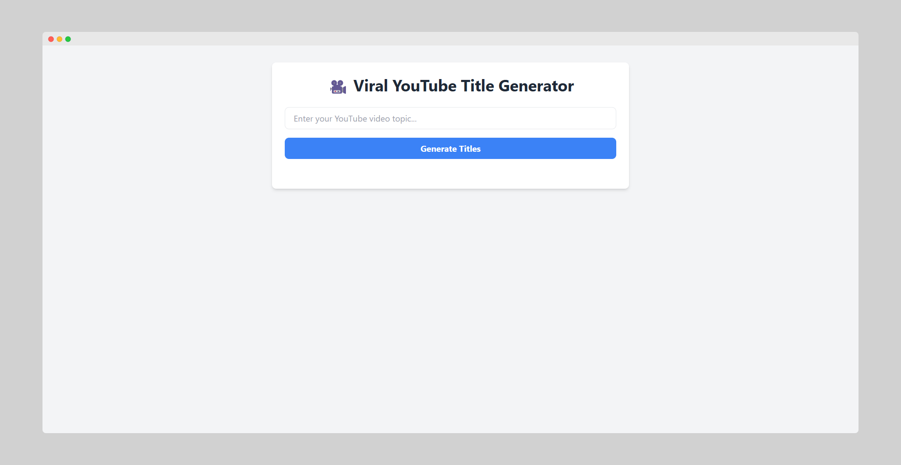

# 🚀 Viral YouTube Title Generator

## Overview
The **Viral YouTube Title Generator** is a self hostable Flask web application that helps users create engaging and click-worthy YouTube titles. By entering a YouTube title, the app generates 10 viral variations using AI-powered text generation from Deepseek's API.



## Features
- Simple UI to enter a YouTube title
- Generates 10 AI-powered viral title variations
- Displays results in a clean, user-friendly format
- Uses Deepseek's API for AI-generated content
- Securely stores API keys using a `.env` file
- Styled with Tailwind CSS for a modern look
- Containerized with Docker for easy deployment

## Installation

### Prerequisites
Ensure you have the following installed:
- Python 3.x
- pip
- Docker (if deploying with Docker)

### Setup
1. Clone the repository:
   ```sh
   git clone https://github.com/tshenolo/viral-yt-title-gen-deepseek.git
   cd viral-yt-title-gen-deepseek
   ```
2. Install dependencies:
   ```sh
   pip install -r requirements.txt
   ```
3. Create a `.env` file to store your API key:  
To use Deepseek's API for generating YouTube titles, you need an API key. 
You can get a free Deepseek API key through [OpenRouter.ai](https://openrouter.ai/deepseek/deepseek-r1:free/api)
   ```sh
   echo "DEEPSEEK_API_KEY=your_api_key_here" > .env
   ```
4. Run the Flask app:
   ```sh
   python app.py
   ```

If you prefer, you can use the OpenAI API as an alternative to the Deepseek API. To use it, refer to the following base URL and model. You can obtain your API key from [OpenAI's API Key page](https://platform.openai.com/api-keys):
   ```sh
   # Base URL and Model for OpenAI API
   Base URL: https://api.openai.com/v1/chat/completions
   Model: gpt-4o-mini
   ```

## Usage
1. Open the app in your browser at [http://localhost:5000](http://localhost:5000).
2. Enter a YouTube title in the text box.
3. Click the submit button.
4. View the 10 viral title variations generated by AI.

## Running with Docker
To run the application inside a Docker container:
```sh
docker build -t viral-yt-title-generator .
docker run -p 5000:5000 --env-file .env viral-yt-title-generator
```

Open the app in your browser at [http://localhost:5000](http://localhost:5000).

If using `docker-compose`, start the service with:
```sh
docker-compose up --build
```

Then access the app at [http://localhost:5000](http://localhost:5000).

## Project Structure
```
├── app.py                  # Main Flask app
├── templates/
│   ├── index.html          # Frontend template
├── requirements.txt        # Python dependencies
├── Dockerfile              # Docker configuration
├── docker-compose.yml      # Docker Compose config
├── .env                    # Environment variables (not in repo)
├── .gitignore              # Ignore unnecessary files
└── test.py                 # Testing script
```

## Contributing
Contributions are welcome! Feel free to open an issue or submit a pull request.

1. Fork the repository.
2. Create a new branch (git checkout -b feature-branch).
3. Commit your changes (git commit -am 'Add new feature').
4. Push to the branch (git push origin feature-branch).
5. Create a new Pull Request.

## License
This project is open-source and available under the [MIT License](LICENSE).

